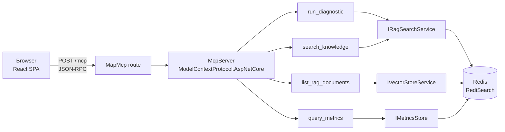

# MCP Playground — Guide

2026-09-22

## Why it exists

FlowScheduler runs as an autonomous system: Hangfire jobs, RAG ingestion, RabbitMQ consumers. When something goes wrong, a human has to open logs, Redis, Hangfire dashboards to understand what happened — slow and manual.

MCP (Model Context Protocol) solves this by exposing the internal state of the system (RAG documents, metrics, error diagnostics) as **tools callable by an AI agent** (Claude Desktop, another LLM, or a future autonomous monitoring agent). The agent no longer has to read code or query Redis directly: it calls a tool with a clear name and parameters, getting a textual response ready to be reasoned upon.

**MCP Playground is the test console for this exposure.** Before connecting an external MCP client (risky, hard to debug as a black box), the page allows you to:

- verify that the tools are actually reachable and registered
- call them manually with parameters of your choice
- read the exact response that an AI agent would receive

It is therefore a tool for those who develop or maintain the AI integration of FlowScheduler, not for the end user of the scheduling system.

## Where it fits in the AI pipeline

FlowScheduler documents its AI architecture as a 7-layer stack (`docs/ai-core/ai-pipeline-architecture.md`). The MCP server registered in `AddMcpServices()` lives at **Layer 4 (AI Tools)**: it reuses the same services (`IVectorStoreService`, `IRagSearchService`, `IMetricsStore`) already used by internal agents (Layer 6/7), but also exposes them to the outside via a standard protocol instead of only internally via DI.

This means: no duplicated logic. An MCP tool like `search_knowledge` calls the same `IRagSearchService.SearchFreeAsync` that an internal diagnostic agent would use — only the channel changes (HTTP/JSON-RPC instead of direct injection).

## Technical Architecture



**Registration (DI):** McpServerExtension.cs exposes two extension methods, following the project convention (Decentralized DI, `*Extension.cs`):

```csharp
public static IServiceCollection AddMcpServices(this IServiceCollection services) {
    services.AddTransient<IRagSearchService, RagSearchService>();
    services.AddMcpServer()
        .WithHttpTransport()
        .WithToolsFromAssembly();
    return services;
}

public static WebApplication MapMcpEndpoints(this WebApplication app) {
    app.MapMcp("/mcp");
    return app;
}
```

`WithToolsFromAssembly()` does auto-discovery: it scans the WebApi assembly for classes marked with `[McpServerToolType]` and registers their `[McpServerTool]` methods as exposed tools — no manual list to maintain.

### The attribute mechanism (`ModelContextProtocol.Server`)

The `ModelContextProtocol.Server` package (dependency of `ModelContextProtocol`, which `ModelContextProtocol.AspNetCore` references) defines two attributes that guide the auto-discovery done by `WithToolsFromAssembly()`:

```csharp
[McpServerToolType]
public class DiagnosticMcpTool {
    [McpServerTool(Name = "run_diagnostic", ReadOnly = true)]
    [Description("Diagnose an error by searching for known solutions...")]
    public async Task<string> RunDiagnosticAsync(
        IRagSearchService ragSearchService,
        [Description("The error message or description to diagnose")] string errorDescription,
        [Description("Error category...")] string? category = null) {
        var result = await ragSearchService.SearchAsync(errorDescription, category);
        // ...
    }
}
```

**What each piece does:**

| Element | Role |
| --- | --- |
| `[McpServerToolType]` | marks the class as a "tool container": without it, `WithToolsFromAssembly()` ignores it even if it has `[McpServerTool]` methods |
| `[McpServerTool(Name=..., ReadOnly=...)]` | marks the method as a callable tool; `Name` is the identifier used in JSON-RPC (`tools/call`), `ReadOnly` is a hint for the client (no side-effects expected) |
| `[Description(...)]` on the method | becomes the tool description in the catalog (`tools/list`) — it is the text that an LLM reads to decide IF and WHEN to call the tool |
| `[Description(...)]` on parameters | becomes the `description` field in the **JSON Schema** generated for that parameter — guides the LLM on WHAT to pass |
| Parameters without `[Description]`, typed as DI service (e.g. `IRagSearchService ragSearchService`) | the SDK recognizes them as dependencies and resolves them from the DI container at each call, it does **not** expose them as tool arguments: an MCP client neither sees nor passes them |
| Parameters with default (`string? category = null`) | become optional in the JSON schema of the tool |
| Return type (`Task<string>`) | the returned text becomes a `{"type":"text","content":...}` block in the JSON-RPC response — seen in the network tab as `result.content[0].text` |

In practice: the C# method **is** the tool definition. There is no separate MCP manifest file to keep synchronized — signature, names, descriptions, and schema all derive by reflection from the attributes at startup time (`WithToolsFromAssembly()` scans the assembly once, during the startup phase).

### Other official SDK options not yet used

In addition to `Name`, `ReadOnly` and `Description`, `[McpServerTool]` exposes other hints (source: official SDK `modelcontextprotocol/csharp-sdk`):

| Property | Default | Meaning | Relevant for our 4 tools? |
| --- | --- | --- | --- |
| `Title` | method name | human-readable label shown instead of `Name` in client UI | yes, would improve readability (e.g. `Title = "Error Diagnostics"`) |
| `Destructive` | **`true`** | signals to the client that the tool can modify/delete state | **to be fixed**: none of the 4 tools explicitly sets it to `false`, despite all being query-only (`ReadOnly = true`). An MCP client might unnecessarily warn the user |
| `Idempotent` | `false` | same input → same effect if called multiple times | our 4 are effectively idempotent (pure queries), not declared |
| `OpenWorld` | `true` | the tool interacts with external, non-enumerable entities (e.g. web) | correct to leave it `true` for `search_knowledge`/`run_diagnostic` (open RAG); `query_metrics`/`list_rag_documents` are "closed world" (only our Redis) → could be `false` |
| `UseStructuredContent` + `OutputSchemaType` | `false` / `null` | instead of returning free text, declares a typed JSON schema for the output | useful if one day an agent needs to read `query_metrics` as structured data instead of parsing strings |
| `IconSource` | `null` | icon shown by the client for the tool | cosmetic, not a priority |

**Other unused SDK features:**

- **`CancellationToken` as method parameter**: the SDK automatically injects it, linking it to the client's MCP cancellation notification. None of the current 4 tools accepts it — a slow call (e.g. `search_knowledge` with Google embedding, seen in testing: 5-8s) cannot be canceled by the client.
- **`McpServer server` as parameter**: gives access to `server.AsSamplingChatClient()` to have the MCP client itself call an LLM ("sampling") — not relevant to our tools, which are direct queries, no need to introduce it.
- **`[McpServerResourceType]` / `[McpServerResource]`**: parallel mechanism to tools for exposing resources at a fixed URI (e.g. `config://app/settings`) instead of callable functions — different use case, does not replace current tools.

None of these are blocking for the location refactor (points 1-4 above); they are subsequent incremental improvements, to be evaluated one at a time.

**Frontend:** Static React SPA served from `wwwroot/mcp-playground/`, mounted in an iframe within the Hangfire Custom Dashboard Page (`/dashboard/mcp-playground-dash`). Communicates with the backend via `POST /mcp` calls in JSON-RPC 2.0 (standard MCP protocol): initial connection (handshake + tool list), then one call for each `Execute`.

**Transport:** `WithHttpTransport()` uses Server-Sent Events / HTTP streaming for the MCP channel — hence the `202 Accepted` requests visible in the network tab during the handshake.

## The 4 exposed tools

| Tool | Parameters | Underlying service | ReadOnly |
| --- | --- | --- | --- |
| `run_diagnostic` | `errorDescription*`, `category?` | `IRagSearchService.SearchAsync` | yes |
| `list_rag_documents` | `context?`, `category?`, `subCategory?`, `docType?`, `page`, `pageSize` | `IVectorStoreService.SearchLibraryAsync` | yes |
| `search_knowledge` | `query*`, `topK` | `IRagSearchService.SearchFreeAsync` | yes |
| `query_metrics` | `category*`, `name*`, `hoursBack` | `IMetricsStore.QueryAsync` | yes |

All `ReadOnly = true`: no tool can write to the state — consistent with the idea of exposing them to an untrusted external agent without risk of side-effects.

**Real example (`run_diagnostic`, tested in session):**

Input: `errorDescription: "RabbitMQ AlreadyClosedException"`

Output:

```
Possible solutions:
- [Solution 42 %] This error happens when the ToolRegistry is not
  registered in services at startup...
  Fix: Register ToolRegistry as a Singleton in the DI container:
  services.AddSingleton<IToolRegistry, ToolRegistry>();
```

42% match (below the 45% automatic bypass threshold, ai-rag-infrastructure.md) — correct: the KB doesn't yet have a specific entry on RabbitMQ, consistent with the open TODO `audit_rabbitmq_crash.md`.

**Real example (`list_rag_documents`, without filters):**

```
- [metrics] Health Report for alexbypa/FlowScheduler2 (cat: devops, created: 2026-09-20)
... (7 similar lines)
- [ops] FlowScheduler (cat: configuration-error-on-toolregistry-cs, created: 2026-09-19)
Page 1 — 8 total documents
```

## Bugs found and fixed in this session

| Bug | Cause | Fix | File |
| --- | --- | --- | --- |
| `POST /mcp` → 404 | `app.MapMcp()` without a pattern mounts the MCP transport on the root route `/`, not on `/mcp` as the frontend expects | explicit `app.MapMcp("/mcp")` | McpServerExtension.cs:29 |
| `list_rag_documents` always "No documents found" | Off-by-one: the tool treats `page` as 1-based (default 1, clamp min 1) but `SearchLibraryAsync` does `Skip(page * pageSize)` 0-based (same convention used by `RagLibraryEndpoints`, which passes `page ?? 0`). With `page=1` and fewer than `pageSize` total documents, the skip skips everything | pass `page - 1` to the service, keeping the tool API 1-based (more natural for an agent) | RagDocumentsMcpTool.cs:23 |

Both confirmed via manual testing on the page after rebuild: `/mcp` responds 200, `list_rag_documents` without filters returns the 8 actual documents in Redis.

**Refactor applied (post-doc publication):** the 4 `*McpTool` classes and their DI registration have moved from `FlowScheduler.WebApi/McpTools/` to `FlowScheduler.Infrastructure/AI/McpServerTools/` (new namespace `Infrastructure.AI.McpServerTools`, `ModelContextProtocol` package added to Infrastructure). WebApi only keeps `McpServerExtension.cs` (hosting: `AddMcpServer().WithHttpTransport()`, `MapMcp("/mcp")`). Motivation: the WebApi Golden Rule ("does not process data directly") was violated by the formatting/pagination logic in the tools. Build 0 errors, 12/12 unit tests green after updating the `using` statements in existing tests. Namespace table in dotnet-boundaries.md updated.

**Subsequent micro-fix:** `WithToolsFromAssembly()` requires an `Assembly` as an anchor, obtained via `typeof(X).Assembly`. The first version used `typeof(DiagnosticMcpTool)` — arbitrary, ties hosting to the existence of a specific business class. Fixed to `typeof(McpServerToolsExtension).Assembly`: the extension class is the stable marker type, its only purpose is the bootstrapping of the feature, it doesn't disappear as long as the feature exists (same idiom as `AddApplicationPart(typeof(Startup).Assembly)` in ASP.NET Core).

## How to use it

URL: `http://localhost:5000/dashboard/mcp-playground-dash` (link visible in the Hangfire Dashboard navbar, "MCP Playground" item).

1. Select a tool from the list at the top
2. Fill in the parameters (`*` = required)
3. `Execute` → the response appears below with execution time, `Formatted` or `Raw JSON` view

**Common troubleshooting:**

- **"Failed to connect to MCP server"** → verify that the WebApi process is actually listening (`netstat -ano | findstr :5000`), don't just trust that another page like `/swagger` responds from an already open cache/tab
- **`POST /mcp` 404** → route not mapped, see bug fixed above
- **Empty/unexpected response on a RAG tool** → check the score threshold (0.45 default, ai-rag-infrastructure.md): a relevant but not very textually similar document might not pass it
- **"Executing..." that seems stuck** → it's not necessarily a bug: embedding calls to Google (`text-embedding-004`) can take 5-8 seconds, check the time shown in `Response` once it arrives

## Do the 4 tools query an LLM?

**No, none of the 4 generates text via LLM** — but it's also not true that it's "only Redis" for all of them. Precise distinction, verified on the response times observed in the tests of this session:

| Tool | Redis (RediSearch) | External AI Call | Observed Time |
| --- | --- | --- | --- |
| `list_rag_documents` | yes (hash scan) | **no** | 15-104ms |
| `query_metrics` | yes (sorted set) | **no** | 8ms |
| `run_diagnostic` | yes (vector KNN) | **yes** — Google `text-embedding-004`, only to vectorize the query | 8279ms |
| `search_knowledge` | yes (vector KNN) | **yes** — same embedding call | 5235ms |

The very high times of `run_diagnostic`/`search_knowledge` seen in the session (5-8 seconds versus 8-100ms of the other two) **are** the empirical proof of the network call to Google — not local processing.

The distinction that matters: **embedding ≠ generation**. An embedding transforms text into a numeric vector for similarity comparison (a deterministic mathematical operation, no "reasoning"). None of the 4 tools use an `IChatClient`/generative LLM (Gemini, Ollama) to produce the response: the returned text is always content **already written** in Redis (field `resolution`/`content` of the documents), only selected and concatenated by `FormatContext()` in RagSearchService.cs — zero synthesis, zero AI reformulation.

Correct conclusion: **2 tools are pure Redis, 2 tools use Redis + an embedding AI model (non-generative) for semantic search.** In no case does an LLM "reason" on the response.
